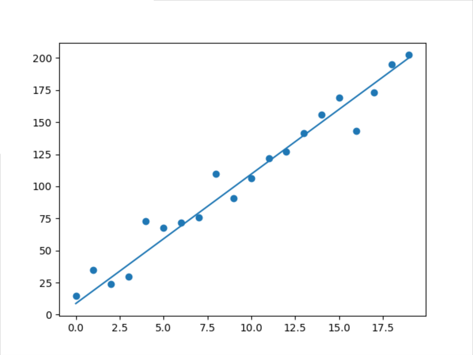
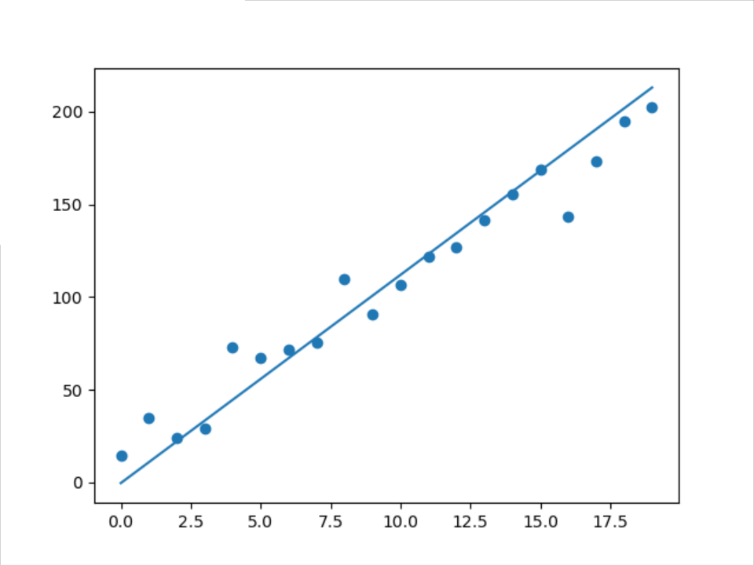
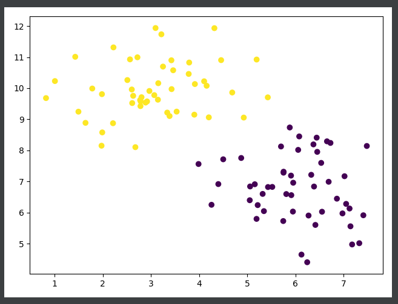

[TOC]

# 线性回归

因为多元线性回归涉及到矩阵运算，很多人（包括我）不是很熟练，所以我们先从一元线性回归开始，先弄清楚线性回归的基本逻辑之后，再推广到多元的情况。一元线性回归实际上是多元线性回归的一个特例，最后将在多元线性回归的视角给出统一的python实现，**从代码的角度更深刻的理解线性回归**。

## 一元线性回归

现在有一堆自变量$(x_1,x_2,...,x_n)$和对应的应变量$y_1,y_2,...,y_n$。线性回归的目的就是找到和样本拟合程度最佳的直线方程。

第一步，假设直线方程为
$$
y'=xw+b
$$
需要求解其中的两个变量$w$和$b$，从而得到这个方程。

该直线要和样本拟合，即将自变量$x$输入该方程得到的值$y'$要和$y$尽可能接近，用均方差（MSE）来衡量整个数据集上的误差（接近程度）：
$$
Loss=\frac{1}{n} \sum_{i}{(y'-y)^2}
$$

最小化这个Loss就能得到和样本拟合程度最佳的直线方程。很显然，这是个凸函数，能够通过求导直接得到最小的均方差，使Loss最小的$w$和$b$就能确定该直线方程。
$$
\frac{\partial{Loss}}{\partial{w}}=\frac{2}{n} \sum_{i}{x_i(x_iw+b-y_i)}
$$

$$
\frac{\partial{Loss}}{\partial{b}}=\frac{2}{n} \sum_{i}{(x_iw+b-y_i)}
$$

使$w$和$b$的偏导同时等于0，可以直接得到$W$和$b$的解析解：
$$
w=\frac{\sum_i{x_iy_i}-\sum_i{x_i}\sum_i{y_i}}{\sum_i{x_i^2}-{(\sum_i{x_i})^2}}
$$

$$
b=\frac{1}{n}(\sum_i{y_i}-w\sum_i{x_i})
$$

至此，一元线性回归到此结束。（这一小结暂时不讲梯度下降的解法，因为完全没有必要，直接能得到解析解的情况下何必用梯度下降得到一个近似解呢？下一节在多元的情况下我们可能无法求解解析解，所以很自然的引入梯度下降来快速得到近似解）

## 多元线性回归

现在还是有一堆自变量$(x_1,x_2,...,x_n)$和对应的应变量$y_1,y_2,...,y_n$，但是每个$x_i=(x_i^1,x_i^2,x_i^3,...x_i^c)$是一个$c$维向量。

直线方程变为以下形式
$$
y'=x^1w^1+x^2w^2+...+x^cw^c+b
$$
改写成向量乘法的形式（公式写起来短，更清晰）：
$$
y'=xw
$$
现在自变量$x=(x^1,x^2,x^3,...x^c,1)$是一个$(c+1)$维的行向量, 参数$w=(w^1,w^2,...,w^c,w^{c+1})^T$是一个$(c+1)$维的列向量。这里的一个小技巧就是通过在自变量的末尾添加常数项1把偏置项（截距）融入到$w$向量中，因此整个式子变成只有一项，后续的运算和分析更加简洁。

同样的，用均方差（MSE）来衡量整个数据集上的误差（接近程度）：
$$
Loss=\frac{1}{n} \sum_{i}{(y'-y)^2}
$$

把这个式子改写成矩阵的形式：
$$
Loss=\frac{1}{n} {(Y'-Y)^T(Y'-Y)}
$$
求Loss函数对$w$的偏导：
$$
\frac{\partial{Loss}}{\partial{w}}=\frac{2}{n}X^T(Y'-Y)
$$

### 多元线性方程的解析解

尝试使偏导等于0，求$w$的解析解：
$$
w=(X^TX)^{-1}X^TY
$$
现在问题出现了，不是每个矩阵都能求逆的，只有满秩矩阵才能求逆，而$(X^TX)$无法保证是一个满秩矩阵，因此无法通过跟一元线性回归一样直接得到$w$了，只能另觅他法。

### 梯度下降法

虽然不能直接得到$w$的解析解了，但是$w$的偏导在上面已经求出来了，我们知道梯度的方向是函数上升最快的方向，那么梯度的反方向即是函数下降最快的地方，因此可以每次向$w$梯度的反方向前进一定的距离$lr$，不断的使Loss函数变小，最终得到局部最优解（对于凸函数来说，也是全局最优解）。
$$
w=w-lr*\frac{\partial{Loss}}{\partial{w}}=w-lr* \frac{2}{n}X^T(Y'-Y)
$$

## python 实现

Talk is cheap, show me the code, 会coding才是真的会。

```python
import numpy as np

class Linear_Regression(object):
    def __init__(self, feat_dim=1):
        self.W = np.random.randn(feat_dim + 1, 1)
        self.W[-1] *= 0

        def train(self, X, y, epoch=100, lr=0.001, use_lsm=False):
        """
        :param X: shape:(N,C)
        :param y: shape:(N,1)
        :param epoch: int
        :param lr: learning rate
        :param use_lsm: use least square method to get W
        """
        if use_lsm:
            assert X.shape[1] == 1, "only unary variables can  use this method "
            sum_x = np.sum(X)
            sum_y = np.sum(y)
            self.W[0] = (np.sum(X * y) - sum_x * sum_y) / (np.sum(X ** 2) - sum_x ** 2)
            self.W[1] = 1 / X.shape[0] * (sum_y - self.W[0] * sum_x)
            return

        X_bias = np.concatenate([X, np.ones((X.shape[0], 1))], axis=1)
        for i in range(epoch):
            y_ = np.dot(X_bias, self.W)  # (N,1)
            loss = np.mean(np.square(y_ - y))
            dW = np.dot(X_bias.T, y_ - y) / X.shape[0]
            self.W[:-1] -= lr * dW[:-1]
            self.W[-1] -= 10 * lr * dW[-1]
            # self.show(X, y)
            if i == int(epoch * 0.5) or i == int(epoch * 0.8):
                lr /= 10

    def predict(self, X):
        X_bias = np.concatenate([X, np.ones((X.shape[0], 1))], axis=1)
        return np.dot(X_bias, self.W)

    def show(self, X, y):
        """
        only for X shape=(N,1)
        """
        import matplotlib.pyplot as plt
        plt.scatter(X[:, 0], y)
        plt.plot(X[:, 0], self.predict(X))
        plt.show()

if __name__ == '__main__':
    LR = Linear_Regression(1)
    X = np.arange(20).reshape(20, 1)
    y = 10 * X + np.ones_like(X) *7 + np.random.randn(20).reshape(20, 1) * 10
    LR.train(X, y)
    LR.show(X, y)
    LR.train(X, y, use_lsm=True)
    LR.show(X, y)
```

拟合结果如下：最小二乘法vs梯度下降法

<figure class="half">


</figure>


# 逻辑回归

线性回归解决的是回归问题，还有一类常见的问题就是分类问题，如下图，有一堆黄色的点和紫色的点，可以明显的看出，能用一条直线将两种不同颜色的点大致分隔开来，所以二元逻辑回归也是求解一条直线方程，这也是逻辑回归往往都放在线性回归后面一起讲的原因。



同样的，假设该直线方程的向量乘法的形式为：
$$
l(x)=xw
$$
现在的问题是如何衡量预测值跟真实值之间的差距？预测值的范围是实数集$\mathbb{R}$​，但是真实值的范围是离散集合$\{0,1\}$​, 取值都不在一个范围内，根本没有可比性​。显然我们需要对预测值进一步进行处理，一个比较直观的方案就是把预测值的范围压缩到[0,1]，这样最终的目标就变成了真实值为1的预测值要接近1，真实值为0的预测值要接近0。sigmoid正好就是满足这样要求的函数，函数表达式如下：
$$
\sigma (x)=\frac{1}{1+e^{-x}}
$$
函数图像如下：


当然选择不止sigmoid这一个函数，理论上只要满足定义域为全体实数，值域是[0,1]的所有可导函数都是满足要求的，但是目前大家还是默认选择sigmoid函数。

现在预测值$y$'变成了
$$
y'=\sigma(l(x))=\frac{1}{1+e^{-xw}}
$$


## 为什么不选择MSE作为分类问题的Loss函数

现在使预测值与真实值之间有了可比性，那Loss函数应该如何构建了？自然的想法当然是跟线性回归一样不就行了吗，但是可惜，答案是不行。

假设$Loss=\frac{1}{n} {(y'-y)^2}$​​,来对参数$w$​求偏导：
$$
\frac{\partial{Loss}}{\partial{w}}=\frac{2}{n}(y'-y)y'(1-y')x
$$
当$y'=\{0,1\}$时，不管是不是跟真实值$y$一致，$w$的梯度都是0，导致无法优化，当然因为sigmoid函数的性质，$y'$不可能会取到$\{0,1\}$​，因为sigmoid的值域是$(0,1)$,但是只要在$0$和$1$的附近，梯度值就会非常小，同样导致无法优化，这就是常说的梯度消失问题。但是这里的梯度消失跟神经网络的梯度消失出现的原因完全不一样，这里是sigmoid函数在极值附近出现饱和区，导数非常小导致的，而神经网络是因为小于1的梯度连乘导致的。

## 极大似然估计

因为预测值和真实值的取值范围是$[0,1]$,可以把sigmoid的输出值理解成真实值为1的概率，那么就可以用极大似然估计去得到参数$w$, 当$y=0$时，事件$x$的后验概率为${y'}^y$，当$y=1$时，事件$x$的后验概率为$({1-y'})^{1-y}$，合并这两种情况，事件$x$的后验概率为${y'}^y+({1-y'})^{1-y}$，那么极大似然函数为：​
$$
F(y')=\prod_i[{y_i'}^{y_i}+({1-{y_i}'})^{1-y_i}]
$$
为了让目标函数与样本数量无关，把似然函数除以样本数，并对两边同时取对数，
$$
ln[F(y')]=\frac{1}{n}\sum_i[{y_i}lny_i+({1-{y_i}})ln(1-{y_i}')]
$$
为了和前面的梯度下降保持一致，把最大化$ln[F(y')]$改成最小化$-ln[F(y')]$,同样对$w$求偏导：
$$
\frac{\partial{-ln[F(y')]}}{\partial{w}}=\frac{1}{n}(y'-y)x
$$


求出来的梯度除了常数项，跟线性分类一模一样。细心的话可以发现用极大似然估计推导出来的Loss函数跟交叉熵一模一样，而交叉熵也是分类的标准损失函数，由此可见，从信息熵的角度和从概率的角度，得出来的优化目标都是一致的。

## python实现

```python
import numpy as np

class Logistic_Regression(object):
    def __init__(self, feat_dim=1):
        self.W = np.random.randn(feat_dim + 1, 1)
        self.W[-1] *= 0

    def train(self, X, y, epoch=1000, lr=0.01):
        """
        :param X: shape:(N,C)
        :param y: shape:(N,1)
        :param epoch: int
        :param lr: learning rate
        """
        X_bias = np.concatenate([X, np.ones((X.shape[0], 1))], axis=1)
        for i in range(epoch):
            y_ = self._sigmoid(np.dot(X_bias, self.W))  # (N,1)
            loss = -np.mean(y * np.log(y_) + (1 - y) * np.log(1 - y_))
            dW = np.dot(X_bias.T, y_ - y) / X.shape[0]
            self.W[:-1] -= lr * dW[:-1]
            self.W[-1] -= 10 * lr * dW[-1]
            # self.show(X, y)
            if i == int(epoch * 0.5) or i == int(epoch * 0.8):
                lr /= 10

    def predict(self, X):
        X_bias = np.concatenate([X, np.ones(X.shape[0], 1)], axis=1)
        return self._sigmoid(np.dot(X_bias, self.W))

    def _sigmoid(self, X):
        return 1 / (1 + np.exp(-X))

    def show(self, X, y):
        """
        only for X shape=(N,2)
        """
        import matplotlib.pyplot as plt
        plt.scatter(X[:, 0], X[:, 1], c=y)
        x_range = np.linspace(start=np.min(X[:, 0]), stop=np.max(X[:, 0]), num=100).reshape(100, 1)
        X_bias = np.concatenate([x_range, np.ones((100, 1))], axis=1)
        y_ = -np.dot(X_bias, np.concatenate([self.W[0:1, ], self.W[2:, ]], axis=0)) / self.W[1]
        plt.plot(x_range, y_)
        plt.show()


if __name__ == '__main__':
    LogR = Logistic_Regression(2)
    X1 = np.concatenate([np.random.randn(50).reshape(50, 1) + 3, np.random.randn(50).reshape(50, 1) + 10], axis=1)
    X2 = np.concatenate([np.random.randn(50).reshape(50, 1) + 6, np.random.randn(50).reshape(50, 1) + 7], axis=1)
    X = np.concatenate([X1, X2], axis=0)
    y = np.array([1] * 50 + [0] * 50).reshape(100, 1)
    LogR.train(X, y)
    LogR.show(X, y)
```

拟合结果如下


